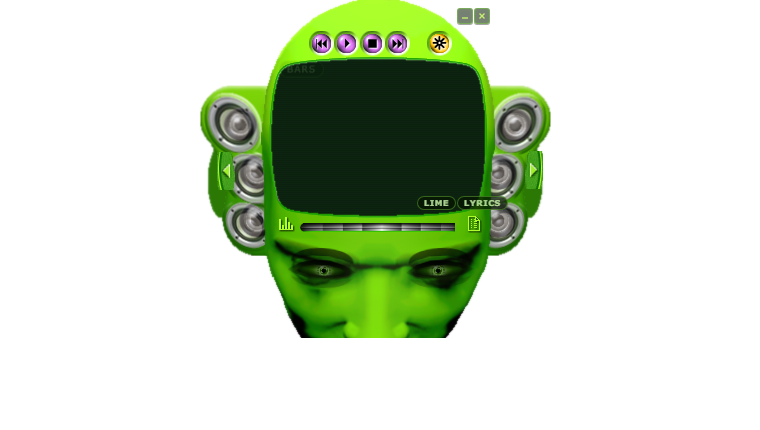

# Headspace Spotify

An Electron Spotify client rebuilt around the classic Headspace alien-head media player skin.



Headspace Spotify keeps the strange, compact desktop charm of the original skin: the alien head, tiny transport controls, sliding drawers, speaker ears, and neon interface language. Underneath, it adds a modern Spotify connection layer with OAuth, playback controls, library browsing, queue views, lyrics, themes, and audio-reactive visuals.

This is a fan/nostalgia project and an experiment in bringing old desktop skin culture back into modern music software.

## Features

- Compact alien-head desktop player built with Electron and Vite.
- Spotify OAuth using PKCE.
- Spotify playback controls with Web Playback SDK support.
- Spotify Connect fallback when local playback is unavailable.
- Library browsing, queue view, and lyrics panel.
- Theme cycling for lime, amber, crimson, magenta, cobalt, and album-art-inspired auto color.
- Audio-reactive visualizer and speaker motion.
- Hidden face-alive Easter egg.

## Screenshots

More screenshots live in [docs/screenshots](docs/screenshots), with a simple gallery in [docs/SCREENSHOTS.md](docs/SCREENSHOTS.md).

## Setup

1. Install dependencies:

   ```powershell
   npm install
   ```

2. Create `.env` from `.env.example` and set your Spotify app client ID:

   ```text
   SPOTIFY_CLIENT_ID=your_spotify_client_id_here
   ```

3. In the Spotify Developer Dashboard, configure this redirect URI:

   ```text
   http://127.0.0.1:8888/callback
   ```

4. Start the app:

   ```powershell
   npm start
   ```

## Development

Build both Electron main and renderer bundles:

```powershell
npm run build
```

Run Electron against the built renderer:

```powershell
npm run electron:dev
```

## Notes

- In-app Spotify playback requires a Spotify Premium account and Widevine support through the Castlabs Electron build.
- Free accounts or DRM failures fall back to Spotify Connect control mode.
- The visualizer prefers live system-audio capture when available, because Spotify no longer reliably exposes audio analysis for newer apps.
- This project is not affiliated with Spotify, Microsoft, Windows Media Player, or the original Headspace skin authors.

## Project Status

Headspace Spotify is shareable as a builder/demo project, but not packaged as a polished public release yet. See [Known Limitations](docs/KNOWN_LIMITATIONS.md) for the current rough edges.

Before posting publicly, use the [Share Checklist](docs/SHARE_CHECKLIST.md).

## Asset Notice

This repo includes original skin assets and converted image assets used for restoration/nostalgia purposes. See [Asset Notice](docs/ASSET_NOTICE.md).
